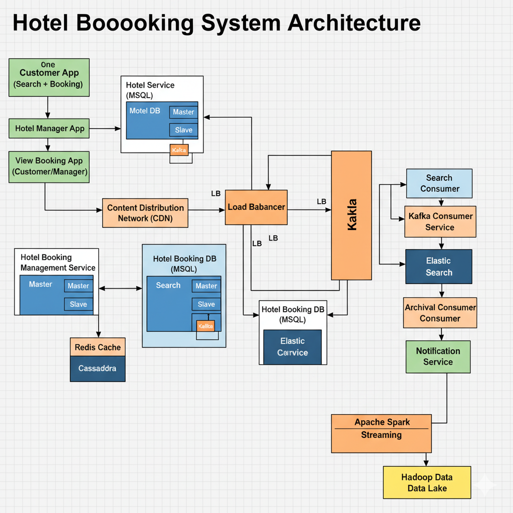

# Requirement Analysis in Software Development

This repository serves as a project blueprint for a **booking management system**, focusing on the critical **Requirement Analysis** phase of the Software Development Lifecycle (SDLC). It documents the process of gathering, analyzing, and structuring requirements to create a clear, detailed foundation for successful software development.

## What is Requirement Analysis?

**Requirement Analysis** is a fundamental stage in the Software Development Lifecycle (SDLC) that involves defining, documenting, and managing the needs and constraints of the users and stakeholders for a new or modified software system. It bridges the gap between the high-level business goals and the technical specifications needed for implementation.

It is a systematic process of understanding what the user expects from the system, identifying conflicts, and resolving ambiguities before design and coding begins. Ultimately, the goal is to produce a precise, clear, and comprehensive **Software Requirements Specification (SRS)** document that serves as the single source of truth for all subsequent development activities.

## Why is Requirement Analysis Important?

Requirement Analysis is critical in the SDLC for several reasons, ensuring projects stay on track and meet stakeholder expectations:

1.  **Minimizes Project Risk and Rework:** Clearly defined requirements significantly reduce the chances of misinterpretation and scope creep during later stages. Changes made late in the development cycle (design, coding, or testing) are exponentially more expensive to fix. Good analysis catches inconsistencies and ambiguities early.

2.  **Sets the Foundation for Success:** A solid requirements document provides the necessary blueprint for all subsequent activities—designers use it to create system architecture, developers use it to write code, and testers use it to create test cases. It ensures everyone is building the right product.

3.  **Ensures Stakeholder Alignment and Satisfaction:** The process involves deep engagement with end-users and stakeholders, confirming that the final product directly addresses their needs and solves their problems. This continuous validation ensures the delivered system is usable, relevant, and meets the initial business objectives.

4.  **Accurate Effort Estimation and Planning:** Detailed requirements allow project managers to make much more accurate estimates for time, cost, and resources. This predictability is vital for budget management and setting realistic project timelines.

## Key Activities in Requirement Analysis

The Requirement Analysis phase typically involves the following five core activities:

* **Requirement Gathering:** The initial step of collecting all potential needs from all relevant sources, including stakeholders, end-users, existing systems, documents, and market research. Techniques include surveys, workshops, and focus groups.
* **Requirement Elicitation:** The process of discovering and extracting the specific needs and goals. This is often done through detailed interviews, brainstorming sessions, and observation of users performing their tasks. The focus is on understanding *why* a requirement exists.
* **Requirement Documentation:** The structured and formal recording of all gathered requirements into a formal document, such as a Software Requirements Specification (SRS). This step standardizes the format, language, and detail level of each requirement.
* **Requirement Analysis and Modeling:** The critical activity of examining the documented requirements for completeness, consistency, feasibility, and clarity. Modeling (e.g., using UML diagrams like Use Case or Activity Diagrams) is used to visually represent the system's structure and behavior to identify gaps and conflicts.
* **Requirement Validation:** The final review process to confirm that the documented requirements truly meet the stakeholders' needs and business goals. This involves formal walkthroughs, inspections, and prototype demonstrations to get final sign-off.

## Types of Requirements

Software requirements are broadly categorized into two main types: Functional and Non-functional.

### Functional Requirements

**Definition:** Functional requirements define the **functions** that a system must perform. They specify *what* the system does and are typically driven by the business needs and user tasks. They describe system behavior under specific conditions.

**Examples for a Booking Management System:**

* **User Authentication:** The system SHALL allow users to register, log in, and securely reset their passwords.
* **Booking Creation:** The system SHALL allow a registered user to select a service (e.g., a room, appointment, or flight), choose an available date/time slot, and place a booking.
* **Payment Processing:** The system SHALL integrate with a third-party payment gateway to securely process credit card payments for a booking.
* **Cancellation Management:** The system SHALL allow users to cancel a confirmed booking up to 24 hours before the service time, automatically triggering a refund for the amount paid.

### Non-functional Requirements

**Definition:** Non-functional requirements (NFRs) define the **quality attributes** or constraints under which the system must operate. They describe *how well* the system performs its functions. NFRs cover areas like performance, security, reliability, and usability.

**Examples for a Booking Management System:**

* **Performance:** The booking search results page SHALL load within a maximum of **3 seconds** for 95% of user requests.
* **Security:** All user passwords and payment information SHALL be encrypted using **AES-256** both in transit and at rest.
* **Usability:** The system's user interface SHALL be **responsive** and fully accessible on major mobile and desktop browsers (Chrome, Firefox, Safari, Edge).
* **Availability:** The booking system SHALL maintain a guaranteed uptime of **99.9%** (excluding scheduled maintenance).
## Use Case Diagrams

**Use Case Diagrams** are a type of behavioral diagram in the Unified Modeling Language (UML) used to describe the functional requirements of a system in terms of **actors** and **use cases**. They illustrate *who* (the actor) interacts with the system and *what* they can do (the use case).

**Benefits:**

* They provide a high-level, easily understandable view of the system's functionalities for stakeholders.
* They help establish the boundary of the system, defining what is inside and what is outside.
* They serve as the foundation for writing detailed use case specifications, which further elaborate on the steps and flow of events for each interaction.

### Booking Management System Use Case Diagram

The diagram below outlines the primary actors and their interactions with the booking management system:

    

## Acceptance Criteria

**Acceptance Criteria (AC)** are conditions that a software product or feature must satisfy to be accepted by a user, customer, or key stakeholder. They define the boundaries of a user story and are used to verify that the system is working correctly and meeting its intended purpose from the user's perspective.

**Importance:**

* **Clear Definition of "Done":** AC provides a clear, objective checklist for developers and testers to determine when a feature is complete.
* **Reduces Ambiguity:** They specify the expected outcome, leaving no room for subjective interpretation of a requirement.
* **Basis for Testing:** AC forms the basis for writing User Acceptance Testing (UAT) and System Integration Testing (SIT) test cases.
* **Ensures Quality:** By focusing on the user's success conditions, AC helps ensure the delivered feature is high-quality and directly solves the user's problem.

### Example Acceptance Criteria for the Checkout Feature

**Feature:** Secure Checkout and Booking Confirmation

**Goal:** Allow the user to finalize their booking, submit payment, and receive a confirmation.

**Acceptance Criteria:**

1.  **GIVEN** the user has a service selected in their booking cart, **WHEN** they click "Proceed to Checkout," **THEN** they SHALL be directed to a secure payment page.
2.  **GIVEN** the user is on the payment page, **WHEN** they successfully enter valid credit card details and submit the form, **THEN** the system SHALL successfully charge the correct total amount via the Payment Gateway.
3.  **GIVEN** the payment is successful, **THEN** the booking status in the database SHALL be updated to "Confirmed," and the user SHALL be shown a "Booking Confirmed" page with a unique booking ID.
4.  **GIVEN** the payment is successful, **THEN** an automated confirmation email containing all booking details (date, time, service, and total cost) SHALL be sent to the user's registered email address.
5.  **GIVEN** the payment fails (e.g., card declined), **THEN** the user SHALL remain on the payment page and be presented with a clear, specific error message explaining the failure.